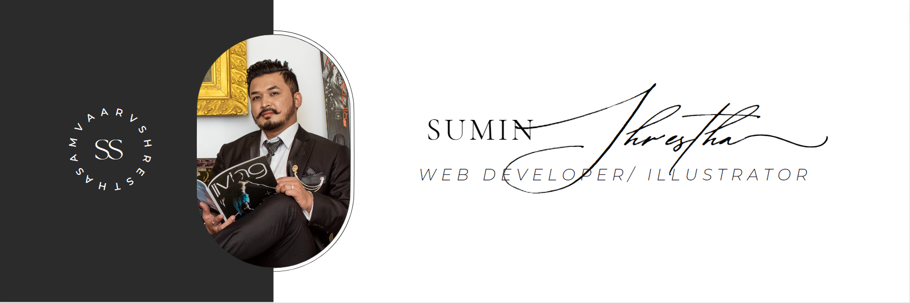

### Hi there! 👋

<!--
**samvaarv/samvaarv** is a ✨ _special_ ✨ repository because its `README.md` (this file) appears on your GitHub profile.

Here are some ideas to get you started:

- 🔭 I’m currently working on ...
- 🌱 I’m currently learning ...
- 👯 I’m looking to collaborate on ...
- 🤔 I’m looking for help with ...
- 💬 Ask me about ...
- 📫 How to reach me: ...
- 😄 Pronouns: ...
- ⚡ Fun fact: ...
-->
My name is Sumin Shrestha but my friends call me ‘Min’. I’m from Nepal
where I finished my Bachelor's degree in Computer Science and
Information Technology from Tribhuvan University. After completing my
bachelor's degree, I worked as a front-end web developer in an IT
company. While working there, I got quite familiar with the working
environment and got to expand my knowledge of web development.

I come from a small family – there are just five of us. Me, my father
and mother, my brother, and our little sister. Also, my dog (Haru) is
quite fidgety and has destroyed most of our clothes, but we still love
him.

I love to cook and sometimes try to make new dishes. In my free time,
I usually like to sketch and do some illustrations while listening to
music like classical ones or K-pop. If you like to see my artwork,
check my Instagram [@khudozhnik.iskusstvo](https://www.instagram.com/khudozhnik.iskusstvo/).

My strengths come from my family and friends who encourage me to do
new things and support me in every situation and my weakness is I get
quite nervous to speak in front of a large audience. So, I also want
to improve my communication skills and be able to read my audiences.
